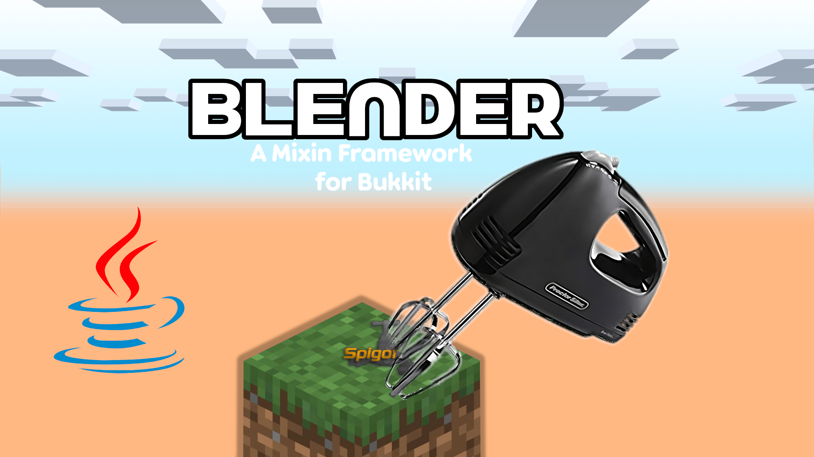

##

## NOTES: THIS IS NOT FULLY RELEASED YET AND WASN'T UPDATED IN 3 YEARS!

**For starters, read the [docs.md](https://github.com/Idiotischer/Blender/blob/docs/docs.md)**
##

## A SMALL INSTALLATION GUIDE CAN BE FOUND HERE

1. Please use the following starting Flags:
```
-Djdk.attach.allowAttachSelf=true
--add-opens=java.base/sun.reflect=ALL-UNNAMED
--add-opens=java.base/java.lang=ALL-UNNAMED
--add-opens=java.base/jdk.internal.loader=ALL-UNNAMED
```

## Compatibility Matrix
**NOTE: THIS REQUIRES AT LEAST JAVA 9 FOR IT TO RUN IN ORDER TO GET IT RUNNING ON OLDER VERSIONS SET use-native-transport=false IN THE server.properties TO true** 

| Minecraft Version | Supported | With Paper (use-native-transport=false) |
|-------------------|-----------|-----------------------------------------|
| 1.20.x            | ✅        | ✅                                     |
| 1.19.x            | ✅        | ✅                                     |
| 1.18.x            | ✅        | ✅                                     |
| 1.17.x            | ✅        | ✅                                     |
| 1.16.x            | ✅        | ✅                                     |
| 1.15.x            | ✅        | ✅                                     |
| 1.14.x            | ✅        | ✅                                     |
| 1.13.x            | ✅        | ✅                                     |
| 1.12.x            | ✅        | ✅                                     |
| 1.11.x            | ❌        | ***Not Tested***                        |
| 1.10.x            | ❌        | ***Not Tested***                        |
| 1.9.x             | ❌        | ***Not Tested***                        |
| 1.8.x             | ❌        | ✅                                     |
| 1.7.x             | ❌        | ***Not Tested***                        |

You *can* also try -DPaper.IgnoreJavaVersion=true
though it's **not tested**

